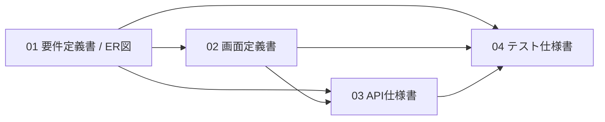

# 営業日報システム 設計ドキュメント一式

| 項目 | 内容 |
| --- | --- |
| プロジェクト | 営業日報システム |
| バージョン | 0.1（ドラフト） |
| 最終更新 | 2026-06-04 |

本リポジトリは営業日報システムの設計ドキュメント一式である。読み始めは本書（00）から、要件→画面→API→テストの順を推奨する。

---

## 1. ドキュメント構成

| No | ファイル | 内容 | 主な読者 |
| --- | --- | --- | --- |
| 00 | `00_index.md` | 本書。全体構成・共通定義・用語集 | 全員 |
| 01 | `01_requirements_definition.md` | 要件定義書（ER図含む） | 企画・開発・テスト |
| 02 | `02_screen_definition.md` | 画面定義書（11画面・遷移図） | デザイナ・フロント・テスト |
| 03 | `03_api_specification.md` | API仕様書（REST・26エンドポイント） | バック・フロント・テスト |
| 04 | `04_test_specification.md` | テスト仕様書（テストケース） | テスト・開発 |

ドキュメント間の依存関係は次のとおり。

---

## 2. システム概要

営業担当者が日次で訪問実績と所感（課題/相談・翌日予定）を報告し、上長（部署長）がコメントでフィードバックするシステム。顧客・営業・部署をマスタ管理する。詳細は 01 要件定義書を参照。

---

## 3. 共通定義（全ドキュメント共通の単一定義）

各ドキュメントはここで定義する値・規約を参照する。変更時は本章を更新する。

### 3.1 ロール

| 値 | 名称 | 概要 |
| --- | --- | --- |
| SALES | 営業 | 自分の日報のCRUD、顧客の参照 |
| MANAGER | 上長／部署長 | 部署メンバーの日報参照・コメント。SALES権限も保持 |
| ADMIN | 管理者 | 顧客・営業・部署マスタの管理 |

### 3.2 ステータス（日報）

| 値 | 名称 | 説明 |
| --- | --- | --- |
| DRAFT | 下書き | 作成・編集中。バリデーション緩和 |
| SUBMITTED | 提出済 | 提出時バリデーションを満たした状態 |

### 3.3 共通規約

| 項目 | 規約 |
| --- | --- |
| JSONフィールド | camelCase |
| 日付 | `YYYY-MM-DD` |
| 日時 | 表示 `YYYY-MM-DD HH:mm` / API `YYYY-MM-DDTHH:mm:ss` |
| 時刻 | `HH:mm` |
| ID | 64bit整数 |
| 削除 | マスタは論理削除（`is_active=false`）。物理削除なし |
| 文字コード | UTF-8 |

### 3.4 主な業務ルール（要約）

- 1営業・1日・1日報（営業ID＋報告日で一意）。
- 提出時は訪問記録1件以上、各行で顧客・訪問内容必須。
- コメントは日報単位の1スレッド（部署長が投稿）。
- 部署は階層を持ち、循環・自部署指定は不可。

詳細な根拠は 01 要件定義書 5章を参照。

---

## 4. 用語集

| 用語 | 説明 |
| --- | --- |
| 日報 | 営業1人の1日分の報告 |
| 訪問記録 | 日報の明細。顧客と訪問内容を1件ずつ持つ |
| Problem | 課題・相談（日報の所感） |
| Plan | 翌日の予定（日報の所感） |
| 部署長 | 部署に設定される管理者。所属営業の上長 |
| 論理削除 | レコードを残したまま有効フラグを無効化する削除方式 |

---

## 5. 変更履歴

| 版 | 日付 | 内容 | 備考 |
| --- | --- | --- | --- |
| 0.1 | 2026-06-04 | 初版作成（要件・ER図・画面・API・テスト・本書） | ドラフト |

---

## 6. 未確定事項（全体）

各ドキュメントの「今後の検討事項」に詳細を記載。横断的な主要論点は次のとおり。

- 提出後の日報編集ロック仕様。
- コメントの編集・削除と通知の要否。
- 認証・認可の方式（JWT、リフレッシュトークン、部署階層をまたぐ参照）。
- 一覧のCSV出力・全文検索、性能目標値。
