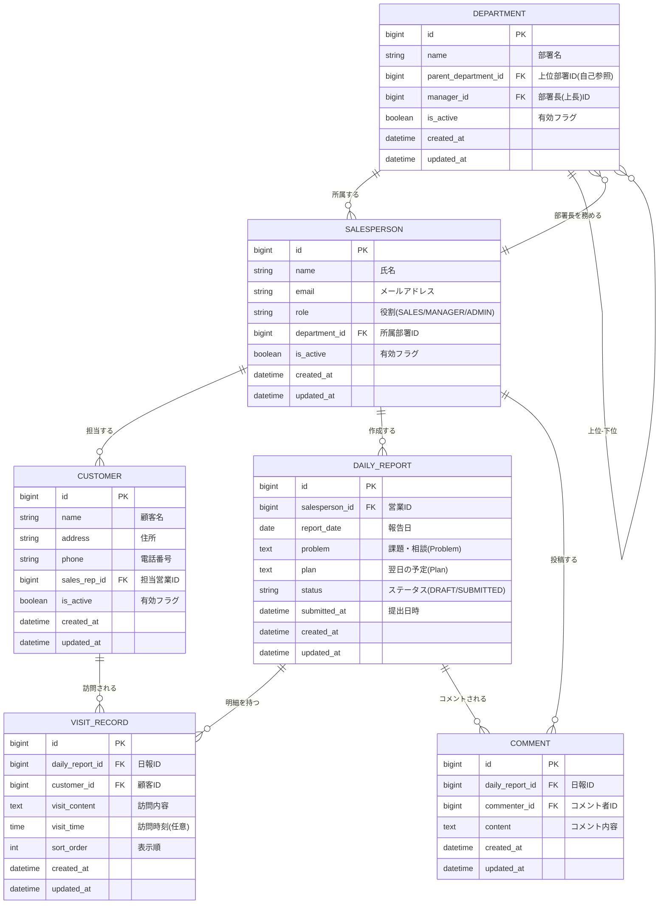

# 営業日報システム 要件定義書

| 項目 | 内容 |
| --- | --- |
| ドキュメント名 | 営業日報システム 要件定義書 |
| バージョン | 0.1（ドラフト） |
| 作成日 | 2026-06-04 |
| 対象システム | 営業日報システム |
| 関連ドキュメント | ER図（本書 6章）、画面定義書、API仕様書、テスト仕様書 |

---

## 1. システム概要

営業担当者が日次で訪問実績（顧客・訪問内容）と所感（課題/相談、翌日の予定）を報告し、上長がそれにコメントしてフィードバックする仕組みを提供する。顧客・営業はマスタで管理し、上長関係は部署マスタの部署長で表現する。

## 2. 用語定義

| 用語 | 説明 |
| --- | --- |
| 日報 | 営業1人の1日分の報告。訪問記録・課題相談・翌日予定を含む |
| 訪問記録 | 日報の明細。1日報に複数件、顧客と訪問内容を1件ずつ持つ |
| 課題・相談（Problem） | 日報に記入する所感の1つ。テキスト |
| 翌日の予定（Plan） | 日報に記入する所感の1つ。テキスト |
| 上長 | 営業の所属部署の部署長 |
| 部署長 | 部署マスタで部署に設定される管理者 |

## 3. 利用者ロール

| ロール | 説明 | 主な権限 |
| --- | --- | --- |
| SALES（営業） | 日報を作成・提出する担当者 | 自分の日報のCRUD、顧客の参照 |
| MANAGER（上長／部署長） | 部下の日報を確認・コメント | 所属部署メンバーの日報参照、コメント投稿。SALES権限も保持 |
| ADMIN（管理者） | マスタを保守 | 顧客・営業・部署マスタのCRUD |

## 4. 機能要件

報告の作成として、営業は日報を作成し、訪問した顧客と訪問内容を複数行登録できる。顧客は顧客マスタから選択する。同じ日報内に課題・相談（Problem）と翌日の予定（Plan）を各1つのテキストで記入し、下書き保存と提出ができる。

フィードバックとして、上長（部署長）は所属部署メンバーの提出済み日報を参照し、日報に対してコメントを投稿できる。コメントは1日報につき1スレッドのフラットな列で、複数件投稿できる。

マスタ管理として、顧客マスタ・営業マスタ・部署マスタをそれぞれ登録・更新できる。営業は部署に所属し、部署には部署長と上位部署（階層）を設定できる。

## 5. 主なビジネスルール

- 1人の営業が同じ日に作成できる日報は1件まで（営業ID＋報告日で一意）。
- 訪問記録は日報に対して0〜N件。提出時は1件以上を必須とし、各行で顧客と訪問内容を必須とする。
- 課題・相談、翌日の予定は任意項目（下書き・提出とも未入力を許容）。
- コメントは原則として日報作成者の部署長が投稿する（権限はアプリ側で制御）。
- 営業の上長は、その営業が所属する部署の部署長とする。
- 部署は階層を持てる（上位部署）。自部署を上位に指定すること、および循環する設定は不可。
- 顧客・営業・部署マスタは論理削除（有効フラグ）とし、物理削除は行わない。

## 6. データ要件（ER図）

主なエンティティは、部署（DEPARTMENT）、営業（SALESPERSON）、顧客（CUSTOMER）、日報（DAILY_REPORT）、訪問記録（VISIT_RECORD）、コメント（COMMENT）。営業は部署に所属し、部署の部署長（manager_id）が上長にあたる。訪問記録は日報の明細、コメントは日報に紐づく。

### 設計上の補足

`DEPARTMENT.manager_id → SALESPERSON` と `SALESPERSON.department_id → DEPARTMENT` が相互参照になるため、両カラムを NULL 許容にするか、登録順序の制御（部署→営業→部署長更新）または外部キー制約の遅延評価で対応する。

## 7. 非機能要件（概要）

| 区分 | 内容 |
| --- | --- |
| セキュリティ | 認証必須、ロールベースのアクセス制御、入力値のサニタイズ |
| 可用性・性能 | 一覧・検索の応答性能（目標値は別途定義） |
| 保守性 | マスタは論理削除で過去日報の参照整合性を維持 |
| 監査 | 各レコードに作成・更新日時を保持 |

## 8. 今後の検討事項

- 提出後の日報編集可否（締め後ロック、再提出フロー）。
- コメントの編集・削除、通知（メール／アプリ内）の要否。
- 認証・認可の方式（JWT想定、リフレッシュトークンの要否）。
- 一覧のページング・ソート・CSV出力、全文検索の要否。
