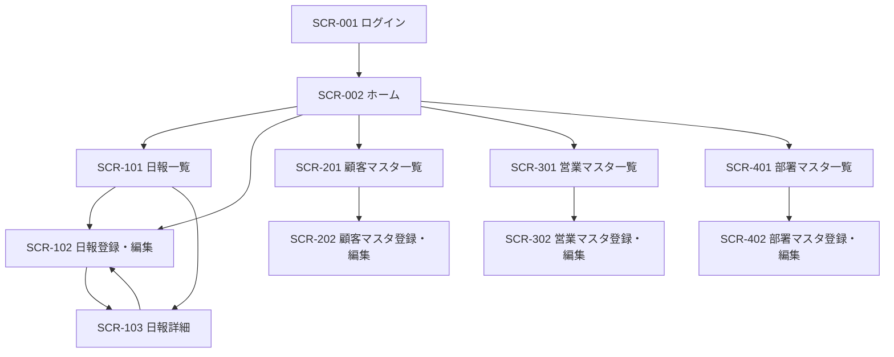

# 営業日報システム 画面定義書

| 項目 | 内容 |
| --- | --- |
| ドキュメント名 | 営業日報システム 画面定義書 |
| バージョン | 0.1（ドラフト） |
| 作成日 | 2026-06-04 |
| 対象システム | 営業日報システム |
| 関連ドキュメント | 要件定義書、ER図 |

---

## 1. 本書の目的・範囲

本書は、営業日報システムの各画面のレイアウト方針、表示項目、操作、画面遷移、入力チェックを定義する。データ構造は別途ER図に従う。

対象範囲は、ログイン・ホーム、日報（一覧／登録・編集／詳細）、各マスタ（顧客・営業・部署）の管理画面とする。

---

## 2. 利用者ロールと権限

| ロール | 説明 | 主な権限 |
| --- | --- | --- |
| SALES（営業） | 日報を作成・提出する担当者 | 自分の日報のCRUD、顧客マスタの参照 |
| MANAGER（上長／部署長） | 部下の日報を確認しコメントする | 所属部署メンバーの日報参照、コメント投稿 |
| ADMIN（管理者） | マスタを保守する | 顧客・営業・部署マスタのCRUD |

※ MANAGER は自身も SALES として日報を作成できる想定。ADMIN ロールはマスタ保守用の前提であり、運用次第で MANAGER に統合可能。

---

## 3. 画面一覧

| 画面ID | 画面名 | 主な利用者 | 概要 |
| --- | --- | --- | --- |
| SCR-001 | ログイン | 全員 | メールアドレス・パスワードで認証する |
| SCR-002 | ホーム | 全員 | 当日日報への導線、未読コメント等を表示 |
| SCR-101 | 日報一覧 | SALES / MANAGER | 日報を一覧・検索する |
| SCR-102 | 日報登録・編集 | SALES | 日報の作成・編集・提出 |
| SCR-103 | 日報詳細 | SALES / MANAGER | 日報の閲覧とコメントスレッド |
| SCR-201 | 顧客マスタ一覧 | ADMIN | 顧客を一覧・検索する |
| SCR-202 | 顧客マスタ登録・編集 | ADMIN | 顧客の登録・編集 |
| SCR-301 | 営業マスタ一覧 | ADMIN | 営業（社員）を一覧・検索する |
| SCR-302 | 営業マスタ登録・編集 | ADMIN | 営業の登録・編集 |
| SCR-401 | 部署マスタ一覧 | ADMIN | 部署を一覧・検索する |
| SCR-402 | 部署マスタ登録・編集 | ADMIN | 部署の登録・編集 |

---

## 4. 画面遷移図

---

## 5. 共通仕様

レイアウトは、画面上部に共通ヘッダ（システム名・ログインユーザー名・ログアウト）、左側にナビゲーション（ホーム／日報／マスタ）、中央にメインコンテンツを配置する。マスタ系メニューは ADMIN のみ表示する。

入力チェックは画面遷移前（クライアント）と保存時（サーバ）の双方で行う。必須未入力・桁数超過・形式不正（メール、日付等）はエラーメッセージを該当項目の近傍に表示する。

ボタンの基本配置は、画面下部右に主アクション（保存・提出）、その左に副アクション（キャンセル・戻る）を置く。削除はマスタでは論理削除（有効フラグ）とし、物理削除は行わない。

日時表示は `YYYY-MM-DD HH:mm`、日付は `YYYY-MM-DD` 形式で統一する。

---

## 6. 画面定義

### SCR-001 ログイン

| 区分 | 内容 |
| --- | --- |
| 概要 | メールアドレスとパスワードで認証し、ホームへ遷移する |
| 利用者 | 全員（未認証） |

**画面項目**

| 項目名 | 種別 | 必須 | 制約・説明 |
| --- | --- | --- | --- |
| メールアドレス | テキスト | ○ | メール形式、最大255文字 |
| パスワード | パスワード | ○ | 最大72文字 |

**操作**

| ボタン／操作 | 動作 | 遷移先 |
| --- | --- | --- |
| ログイン | 認証を実行 | 成功時 SCR-002、失敗時は同画面でエラー表示 |

---

### SCR-002 ホーム

| 区分 | 内容 |
| --- | --- |
| 概要 | 当日の日報作成への導線、自分宛の未読コメント、本日の日報提出状況を表示 |
| 利用者 | 全員 |

**主な表示要素**

| 要素 | 説明 |
| --- | --- |
| 本日の日報ステータス | 未作成／下書き／提出済 を表示し、編集画面への導線を出す |
| 最近のコメント | 自分の日報に付いた直近のコメントを数件表示 |
| クイックリンク | 日報一覧、各マスタ（ADMINのみ）への導線 |

**操作**

| ボタン／操作 | 動作 | 遷移先 |
| --- | --- | --- |
| 本日の日報を書く | 当日日報を新規 or 続きから編集 | SCR-102 |
| 日報一覧へ | 一覧表示 | SCR-101 |

---

### SCR-101 日報一覧

| 区分 | 内容 |
| --- | --- |
| 概要 | 日報を条件で絞り込み一覧表示する。SALESは自分の日報、MANAGERは所属部署メンバーの日報も参照可 |
| 利用者 | SALES / MANAGER |

**検索条件**

| 項目名 | 種別 | 必須 | 説明 |
| --- | --- | --- | --- |
| 報告日（From-To） | 日付範囲 | - | 期間で絞り込み |
| 営業担当 | プルダウン | - | MANAGERのみ表示。部署メンバーから選択 |
| ステータス | プルダウン | - | 下書き／提出済 |

**一覧項目**

| 項目名 | 説明 |
| --- | --- |
| 報告日 | 日報の対象日 |
| 営業担当 | 作成者氏名 |
| 訪問件数 | 紐づく訪問記録の件数 |
| ステータス | 下書き／提出済 |
| コメント有無 | コメントの有無・件数 |

**操作**

| ボタン／操作 | 動作 | 遷移先 |
| --- | --- | --- |
| 行クリック | 日報を開く | SCR-103 |
| 新規作成 | 当日日報を作成 | SCR-102 |
| 編集（自分の下書き行） | 編集を開く | SCR-102 |

---

### SCR-102 日報登録・編集

| 区分 | 内容 |
| --- | --- |
| 概要 | 1日分の日報を作成・編集する。訪問記録は複数行登録可能。下書き保存と提出ができる |
| 利用者 | SALES（自分の日報のみ） |

**ヘッダ項目**

| 項目名 | 種別 | 必須 | 制約・説明 |
| --- | --- | --- | --- |
| 報告日 | 日付 | ○ | 同一営業・同一日で1件のみ（重複時エラー） |
| 営業担当 | 表示のみ | - | ログインユーザーを自動設定 |

**訪問記録（明細・複数行）**

| 項目名 | 種別 | 必須 | 制約・説明 |
| --- | --- | --- | --- |
| 顧客 | プルダウン | ○ | 顧客マスタから選択 |
| 訪問時刻 | 時刻 | - | 任意 |
| 訪問内容 | テキストエリア | ○ | 最大2000文字 |

明細は「行追加」で任意件数を追加でき、各行に「行削除」を備える。行の並び順（sort_order）はドラッグまたは上下移動で変更可能とする。

**所感**

| 項目名 | 種別 | 必須 | 制約・説明 |
| --- | --- | --- | --- |
| 課題・相談（Problem） | テキストエリア | - | 最大2000文字 |
| 翌日の予定（Plan） | テキストエリア | - | 最大2000文字 |

**操作**

| ボタン／操作 | 動作 | 遷移先 |
| --- | --- | --- |
| 行追加 | 訪問記録の入力行を1行追加 | 同画面 |
| 行削除 | 対象の訪問記録行を削除 | 同画面 |
| 下書き保存 | status=DRAFT で保存 | 同画面（保存完了表示） |
| 提出 | 入力チェック後 status=SUBMITTED、提出日時を記録 | SCR-103 |
| キャンセル | 変更を破棄 | SCR-101 |

**バリデーション**

報告日は必須で、同一営業・同一報告日の既存日報があれば登録不可。提出時は訪問記録を1件以上必須とし、各行で顧客と訪問内容を必須とする（下書き保存時は未入力許容）。

---

### SCR-103 日報詳細

| 区分 | 内容 |
| --- | --- |
| 概要 | 日報の内容を参照し、コメントスレッドを表示する。1日報につき1スレッドのフラットなコメント列 |
| 利用者 | SALES（自分の日報）／ MANAGER（部署メンバーの日報） |

**表示項目**

| 項目名 | 説明 |
| --- | --- |
| 報告日・営業担当・ステータス | 日報のヘッダ情報 |
| 訪問記録一覧 | 顧客名／訪問時刻／訪問内容を行順に表示 |
| 課題・相談（Problem） | テキスト表示 |
| 翌日の予定（Plan） | テキスト表示 |
| コメントスレッド | 投稿者・投稿日時・本文を時系列で表示 |

**コメント投稿**

| 項目名 | 種別 | 必須 | 制約・説明 |
| --- | --- | --- | --- |
| コメント本文 | テキストエリア | ○ | 最大1000文字。MANAGER に表示。SALESは閲覧のみ |

**操作**

| ボタン／操作 | 動作 | 遷移先 |
| --- | --- | --- |
| コメント投稿 | コメントを1件追加 | 同画面（スレッド更新） |
| 編集 | 自分の日報を編集（下書き時のみ等の運用ルールは別途） | SCR-102 |
| 戻る | 一覧へ戻る | SCR-101 |

---

### SCR-201 顧客マスタ一覧

| 区分 | 内容 |
| --- | --- |
| 概要 | 顧客を検索・一覧する | 
| 利用者 | ADMIN |

**検索条件**

| 項目名 | 種別 | 説明 |
| --- | --- | --- |
| 顧客名 | テキスト | 部分一致 |
| 担当営業 | プルダウン | 担当者で絞り込み |
| 有効フラグ | プルダウン | 有効／無効 |

**一覧項目**：顧客名、住所、電話番号、担当営業、有効フラグ

**操作**

| ボタン／操作 | 動作 | 遷移先 |
| --- | --- | --- |
| 新規登録 | 登録画面を開く | SCR-202 |
| 行クリック | 編集画面を開く | SCR-202 |

---

### SCR-202 顧客マスタ登録・編集

| 区分 | 内容 |
| --- | --- |
| 概要 | 顧客の登録・編集を行う |
| 利用者 | ADMIN |

**画面項目**

| 項目名 | 種別 | 必須 | 制約・説明 |
| --- | --- | --- | --- |
| 顧客名 | テキスト | ○ | 最大100文字 |
| 住所 | テキスト | - | 最大255文字 |
| 電話番号 | テキスト | - | 数字・ハイフン、最大20文字 |
| 担当営業 | プルダウン | - | 営業マスタから選択 |
| 有効フラグ | チェックボックス | - | 既定は有効 |

**操作**：保存（SCR-201へ）、キャンセル（SCR-201へ）

---

### SCR-301 営業マスタ一覧

| 区分 | 内容 |
| --- | --- |
| 概要 | 営業（社員）を検索・一覧する |
| 利用者 | ADMIN |

**検索条件**：氏名（部分一致）、所属部署、役割、有効フラグ

**一覧項目**：氏名、メールアドレス、役割、所属部署、有効フラグ

**操作**：新規登録／行クリック → SCR-302

---

### SCR-302 営業マスタ登録・編集

| 区分 | 内容 |
| --- | --- |
| 概要 | 営業（社員）の登録・編集を行う |
| 利用者 | ADMIN |

**画面項目**

| 項目名 | 種別 | 必須 | 制約・説明 |
| --- | --- | --- | --- |
| 氏名 | テキスト | ○ | 最大100文字 |
| メールアドレス | テキスト | ○ | メール形式、システム内で一意、最大255文字 |
| 役割 | プルダウン | ○ | SALES / MANAGER / ADMIN |
| 所属部署 | プルダウン | ○ | 部署マスタから選択 |
| 有効フラグ | チェックボックス | - | 既定は有効 |

**操作**：保存（SCR-301へ）、キャンセル（SCR-301へ）

---

### SCR-401 部署マスタ一覧

| 区分 | 内容 |
| --- | --- |
| 概要 | 部署を検索・一覧する |
| 利用者 | ADMIN |

**検索条件**：部署名（部分一致）、上位部署、有効フラグ

**一覧項目**：部署名、上位部署、部署長、有効フラグ

**操作**：新規登録／行クリック → SCR-402

---

### SCR-402 部署マスタ登録・編集

| 区分 | 内容 |
| --- | --- |
| 概要 | 部署の登録・編集を行う。階層と部署長を設定する |
| 利用者 | ADMIN |

**画面項目**

| 項目名 | 種別 | 必須 | 制約・説明 |
| --- | --- | --- | --- |
| 部署名 | テキスト | ○ | 最大100文字 |
| 上位部署 | プルダウン | - | 部署マスタから選択（自部署および循環は不可） |
| 部署長 | プルダウン | - | 営業マスタから選択。この部署メンバーの上長になる |
| 有効フラグ | チェックボックス | - | 既定は有効 |

**操作**：保存（SCR-401へ）、キャンセル（SCR-401へ）

**バリデーション**：上位部署に自部署を選択不可。階層が循環する設定は不可。

---

## 7. 今後の検討事項

- 日報の提出後に編集を許可するか（締め後ロック、再提出フローの要否）。
- コメントの編集・削除可否、通知（メール／アプリ内）の要否。
- 顧客・営業の検索におけるページング・ソート・CSV出力の要否。
- 認証・認可の方式（セッション／JWT 等）と ADMIN ロールの最終的な扱い。
